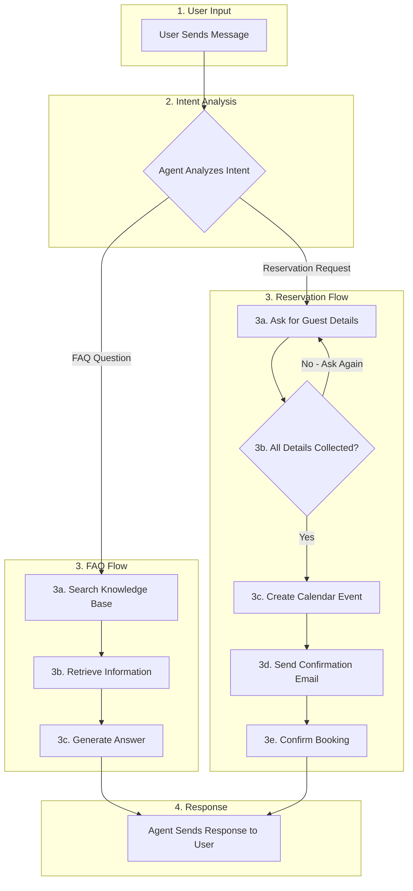

# El-Qess Restaurant AI Assistant

## 1. Name

**El-Qess Restaurant AI Assistant** 

---

## 2. Description

El-Qess Restaurant AI Assistant is an AI-powered virtual assistant for an authentic Moroccan restaurant, built using Langflow's visual development platform. The assistant handles three core functions:

1. **FAQ Answering** - Responds to customer questions about menu, hours, prices, and policies using a RAG (Retrieval-Augmented Generation) system
2. **Reservation Management** - Collects guest details and creates calendar events for table bookings
3. **Email Confirmations** - Automatically sends reservation confirmation emails to guests

### Langflow Components Used

1. **Chat Input/Output** - Handle user conversation interface
2. **Agent with Custom LLM** - Core reasoning engine that processes requests and orchestrates tools
3. **File Loader** - Loads restaurant knowledge base documents
4. **Recursive Text Splitter** - Chunks documents for efficient embedding
5. **OpenAI Embeddings** - Converts text chunks into vector representations
6. **Chroma DB** - Vector store for semantic search of restaurant information
7. **Google Calendar (Composio)** - MCP tool for creating and managing reservations
8. **Gmail (Composio)** - MCP tool for sending confirmation emails

The agent leverages MCP (Model Context Protocol) servers via Composio integration, demonstrating how Langflow simplifies connecting external services to AI agents through visual drag-and-drop configuration rather than custom code.

---

## 3. Workflow

### User/Agent Flow Diagram

### Workflow Steps

**Step 1: User Input**
- User sends a message to the agent (question or request)

**Step 2: Intent Analysis**
- Agent analyzes the message to determine:
  - Is it an **FAQ question**? → Go to FAQ Flow
  - Is it a **reservation request**? → Go to Reservation Flow

**Step 3A: FAQ Flow**
- 3a. Search knowledge base for relevant information
- 3b. Retrieve matching content from restaurant documents
- 3c. Generate natural language answer

**Step 3B: Reservation Flow**
- 3a. Ask user for required details (date, time, guests, name, email, phone)
- 3b. Check if all required details are collected
- 3c. Create Google Calendar event with reservation details
- 3d. Send confirmation email to guest via Gmail
- 3e. Confirm successful booking to user
---

## 5. MCP Servers Used

This project uses **Composio** as the MCP (Model Context Protocol) integration layer, which provides pre-built connections to external services. Two MCP servers were integrated:

### MCP Servers

1. **Google Calendar MCP Server**
   - Provider: Composio
   - Purpose: Manage restaurant reservations in Google Calendar
   - Authentication: OAuth 2.0 via Composio

2. **Gmail MCP Server**
   - Provider: Composio
   - Purpose: Send reservation confirmation emails to guests
   - Authentication: OAuth 2.0 via Composio

### MCP Tools Enabled

**Google Calendar Tools:**
1. `GOOGLECALENDAR_CREATE_EVENT` - Create new reservation events with guest details, date, time, and special requests
2. `GOOGLECALENDAR_FIND_EVENT` - Search for existing reservations by guest name or date
3. `GOOGLECALENDAR_DELETE_EVENT` - Cancel reservations when requested by guests

**Gmail Tools:**
1. `GMAIL_SEND_EMAIL` - Send reservation confirmation emails directly to guests with booking details

### How MCP Integration Works

1. **Composio API Key** is added to the Langflow components
2. **OAuth authentication** connects the agent to the restaurant's Google account
3. **Tool Mode** is enabled on each component, exposing the tools to the agent
4. **Agent orchestration** - The agent automatically selects the appropriate tool based on user intent

---

## 6. Documents Used for RAG

1. **el_qess_knowledge.txt** - Restaurant info, menu with prices, hours, location, and dietary options
2. **el_qess_faqs.txt** - Common questions about reservations, policies, and dining experience
