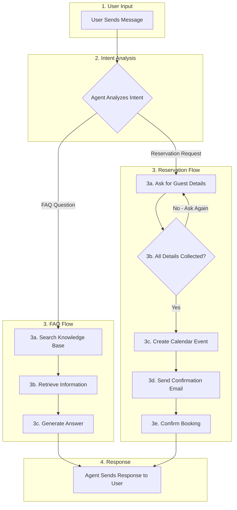

# El-Qess Restaurant AI Assistant

## 1. Name

**El-Qess Restaurant AI Assistant** (مساعد مطعم القصّ الذكي) 

---

## 2. Description

El-Qess Restaurant AI Assistant is an AI-powered virtual assistant for an authentic Moroccan restaurant, built using Langflow's visual development platform. The assistant handles three core functions:

1. **FAQ Answering** - Responds to customer questions about menu, hours, prices, and policies using a RAG (Retrieval-Augmented Generation) system
2. **Reservation Management** - Collects guest details and creates calendar events for table bookings
3. **Email Confirmations** - Automatically sends reservation confirmation emails to guests

### Langflow Components Used

1. **Chat Input/Output** - Handle user conversation interface
2. **Agent with Custom LLM** - Core reasoning engine that processes requests and orchestrates tools
3. **File Loader** - Loads restaurant knowledge base documents
4. **Recursive Text Splitter** - Chunks documents for efficient embedding
5. **OpenAI Embeddings** - Converts text chunks into vector representations
6. **Chroma DB** - Vector store for semantic search of restaurant information
7. **Google Calendar (Composio)** - MCP tool for creating and managing reservations
8. **Gmail (Composio)** - MCP tool for sending confirmation emails

The agent leverages MCP (Model Context Protocol) servers via Composio integration, demonstrating how Langflow simplifies connecting external services to AI agents through visual drag-and-drop configuration rather than custom code.

---

## 3. Workflow

### User/Agent Flow Diagram



### Workflow Steps

**Step 1: User Input**
- User sends a message to the agent (question or request)

**Step 2: Intent Analysis**
- Agent analyzes the message to determine:
  - Is it an **FAQ question**? → Go to FAQ Flow
  - Is it a **reservation request**? → Go to Reservation Flow

**Step 3A: FAQ Flow**
- 3a. Search knowledge base for relevant information
- 3b. Retrieve matching content from restaurant documents
- 3c. Generate natural language answer

**Step 3B: Reservation Flow**
- 3a. Ask user for required details (date, time, guests, name, email, phone)
- 3b. Check if all required details are collected
- 3c. Create Google Calendar event with reservation details
- 3d. Send confirmation email to guest via Gmail
- 3e. Confirm successful booking to user

**Step 4: Response**
- Agent sends the final response back to the user

---

## 4. Why Langflow?

Langflow was chosen for this project for several key reasons:

### Visual Development
- **No-code/Low-code approach** - Build complex AI workflows by dragging and connecting components
- **Intuitive interface** - Easy to understand the flow of data between components
- **Rapid prototyping** - Quickly test and iterate on agent designs

### Easy MCP Server Integration
Langflow makes connecting MCP servers remarkably simple:

1. **Built-in Composio Integration** - Langflow includes native support for Composio, a platform that provides pre-built MCP server connections for popular services like Google Calendar and Gmail

2. **Simple Authentication** - Just add your Composio API Key and the OAuth flow handles Google account authentication automatically

3. **Tool Mode Toggle** - Enable "Tool Mode" on any component with one click to make it available to the agent as a callable tool

4. **No Custom Code Required** - Unlike traditional approaches that require writing API integration code, Langflow's MCP components work out-of-the-box

5. **Multiple Tools, One Agent** - Easily connect multiple MCP tools (Calendar, Gmail, etc.) to a single agent by linking their Toolset outputs to the Agent's Tools input

### RAG Made Simple
- **Drag-and-drop vector store setup** - Connect File → Text Splitter → Embeddings → Vector Store in minutes
- **Automatic chunking and embedding** - No manual text processing needed
- **Tool Mode for retrieval** - The agent automatically searches the knowledge base when needed

### Flexibility
- **Custom Components** - When built-in components aren't enough, create custom Python components (like our Custom LLM Agent)
- **Multiple LLM Support** - Switch between different AI models easily

---

## 5. MCP Servers Used

This project uses **Composio** as the MCP (Model Context Protocol) integration layer, which provides pre-built connections to external services. Two MCP servers were integrated:

### MCP Servers

1. **Google Calendar MCP Server**
   - Provider: Composio
   - Purpose: Manage restaurant reservations in Google Calendar
   - Authentication: OAuth 2.0 via Composio

2. **Gmail MCP Server**
   - Provider: Composio
   - Purpose: Send reservation confirmation emails to guests
   - Authentication: OAuth 2.0 via Composio

### MCP Tools Enabled

**Google Calendar Tools:**
1. `GOOGLECALENDAR_CREATE_EVENT` - Create new reservation events with guest details, date, time, and special requests
2. `GOOGLECALENDAR_FIND_EVENT` - Search for existing reservations by guest name or date
3. `GOOGLECALENDAR_DELETE_EVENT` - Cancel reservations when requested by guests

**Gmail Tools:**
1. `GMAIL_SEND_EMAIL` - Send reservation confirmation emails directly to guests with booking details

### How MCP Integration Works

1. **Composio API Key** is added to the Langflow components
2. **OAuth authentication** connects the agent to the restaurant's Google account
3. **Tool Mode** is enabled on each component, exposing the tools to the agent
4. **Agent orchestration** - The agent automatically selects the appropriate tool based on user intent

---

## 6. Knowledge Base Used

The agent uses a **RAG (Retrieval-Augmented Generation)** system to answer restaurant questions accurately.

### Documents

1. **el_qess_knowledge.txt** - Restaurant info, menu with prices, hours, location, and dietary options
2. **el_qess_faqs.txt** - Common questions about reservations, policies, and dining experience

### RAG Pipeline

1. **File Loader** - Loads knowledge documents
2. **Recursive Text Splitter** - Chunks text (1000 chars, 200 overlap)
3. **OpenAI Embeddings** - Converts chunks to vectors
4. **Chroma DB** - Stores and searches vectors semantically

### How It Works

User asks question → Agent searches vector store → Retrieves relevant info → Generates accurate answer

---

## 7. System Prompt

*(Add your system prompt here)*

---

## 8. Test Results

*(Add your test screenshots here)*

---

## Project Structure

```
el-qess-restaurant-agent/
├── README.md
├── Flow.json
├── el_qess_knowledge.txt
└── el_qess_faqs.txt
```

---

## Summary

This project demonstrates how Langflow simplifies building AI agents with MCP server integrations. The El-Qess Restaurant AI Assistant showcases:

- **RAG-based knowledge retrieval** for accurate FAQ responses
- **MCP tool integration** via Composio for Google Calendar and Gmail
- **Custom LLM support** through a custom agent component
- **End-to-end reservation workflow** from booking to email confirmation

The visual, no-code approach of Langflow makes it accessible to build production-ready AI agents without extensive programming, while still allowing customization through custom components when needed.
